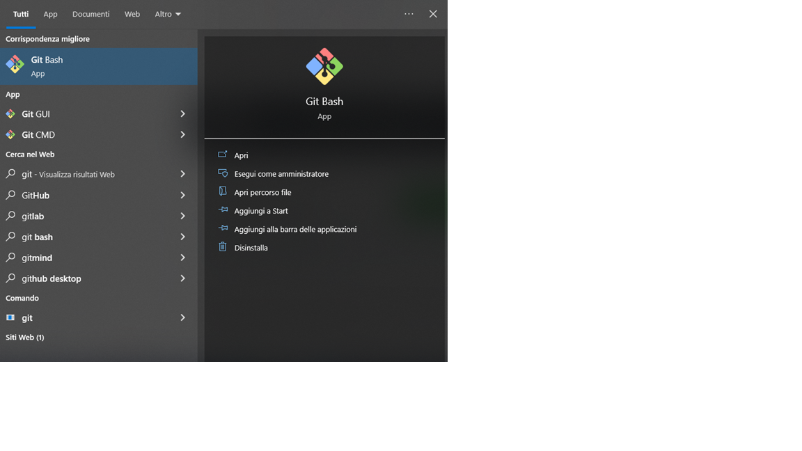
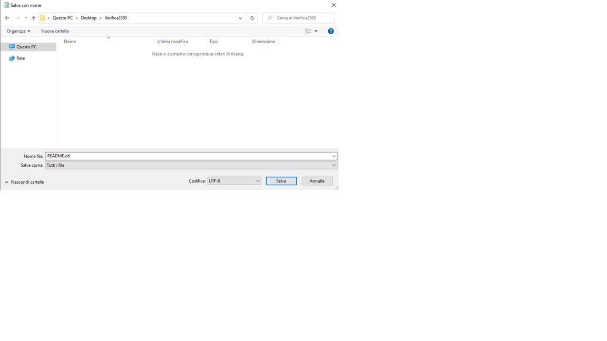
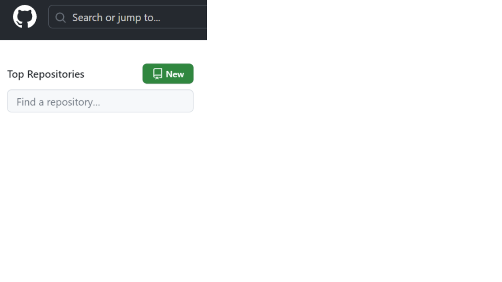
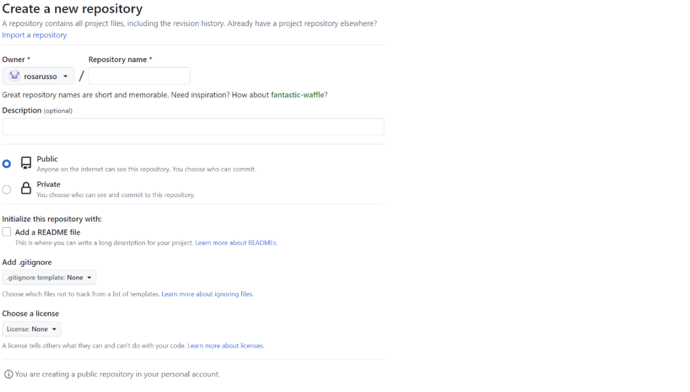
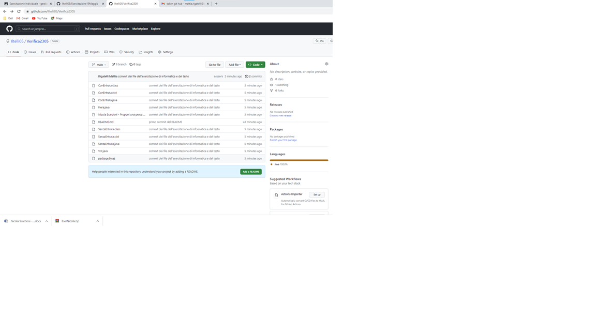

# Verifica di Progettazione 23-05
## Tutorial per la creazione di una repository
### Creare una repository e file README.md
 - Creare una cartella sul Desktop (in questo caso: Verifica2305)
 - Aprire git bash (questa icona)



 - Una volta aperto eseguire il comando:
```cd $HOME/path/to/repName # path/to rappresenta il percorso per arrivare alla cartella, mentre repName rappresenta il nome della cartella```
 - Creare il file README sul blocco note, poi deve essere salvato nella cartella creata precedentemente e salvarlo come .md



 - Una volta salvato il file, fare l'accesso al sito https://github.com con il proprio username e la password
 - In alto a sinistra e cliccare su New per creare una nuova repository (Esempio nell'immagine sottostante)



 - Seguire le seguenti impostazioni per la creazione della repository sul sito



 - Cliccare su create in fondo alla pagina

### Configurazione della repository locale e sincronizzazione da git bash
 - Bisogna eseguire i seguenti comandi dal prompt di git bash:

```
git init # per inizializzare
git add README.md  # Inserimento del file README.md nell'area di staging
git commit -m "first commit"  # Creazione del primo commit, che serve a sincronizzare il repository locale con lo stage
git branch -M main  # Creazione del branch main, da usare come default
git remote add origin https://github.com/<username>/Esercitazione16maggio  # Connessione del repository remoto al repository locale
git push -u origin main  # Sincronizzazione del repository remoto con quello locale
```

### Aggiunti dei file alla repository (in questo caso esercitazione pre verifica di informatica del compagno Nicola Scardoni)
 - Scaricare i file dal compito di classroom


 - Estrarre i file dalla cartella zip nella cartella Verifica2305
 - una volta aggiunti tutti i file alla cartella bisogna tornare su git bash ed eseguire i seguenti comandi

```
git add . # aggiunta all'area di staging di tutti i file della cartella
git commit -m "commit dei file dell'esercitazione di informatica e del testo" # Creazione del commit, che serve a sincronizzare il repository locale con lo stage
git push -u origin main # Sincronizzazione del repository remoto con quello locale
```
 - Abbiamo finito ora sul sito nella nostra repository dovremmo trovarci in questa situazione:



# Commento del codice ed esposizione

## Spiegazione dell'esercizio
### Pratica
Questo esercizio deve simulare la gestione di 3 code per entrare ad una fiera, dove si gesticono tre casi: con entrata, senza entrata e vip.
Successivamnete bisogna salvare i dati delle persone che lasciano le file, in una struttura dati, per poi fare delle statistiche (sul sesso, il tipo di biglietto) e poter ricercare le persone in base ad alcuni dati forniti

### Teoria
Per ogni collezione scrivere la super classe ed i pro e i contro della collezione

## Classe ConEntrata
### metodo ConEntrata
 - costruttore della classe
### metodo clone
 - clone del oggetto
### metodi setter
 - metodi che assegnano un valore al attributo
### metodi getter
 - metodi che mostrano il valore del contenuto

## Classe SenzaEntrata
### metodo SenzaEntrata
 - costruttore della classe
### metodo clone
 - clone del oggetto
### metodi setter
 - metodi che assegnano un valore al attributo
### metodi getter
 - metodi che mostrano il valore del contenuto

## Classe VIP
### metodo VIP
 - costruttore della classe
### metodo clone
 - clone del oggetto
### metodi setter
 - metodi che assegnano un valore al attributo
### metodi getter
 - metodi che mostrano il valore del contenuto

## Classe Fiera
 - è ancora incompleta

# Funzioni base di git ed i comandi utili di github per realizzare il README.md
## Comandi per le modifiche del file README.md

### Comandi:
Per inserire i comandi come sopra bisogna utilizzare il carattere " ` " che si scrive con la combinazione Alt + 96.
### Foto:
 - Fare lo screenshoot con Windows + Shift Sx + S.
 - Salvare gli screenshoot nella cartella ed utilizzare il comando: `
### Titoli:
 Per fare i titoli bisogna utilizzare il # in base a quanti cancelletti si utilizzano vengono creati i titoli (usare il seguente layout "# Titolo").

## Comandi che si possono utilizzare su git bash
```
git init # inizializza una repository
git add # aggiunta di un file all'area di staging
git branch # creare o cancellare un branch della repository
git commit # sincronizza il repository locale con lo stage
git push # carica i file dell'area di staging nella repository remota
git help # mostra tutti i comandi con una successiva descrizione
```
